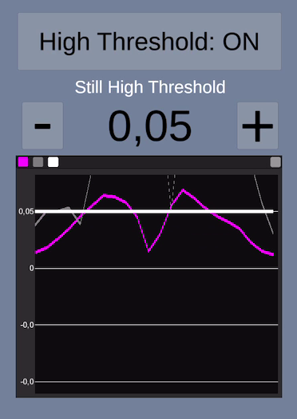
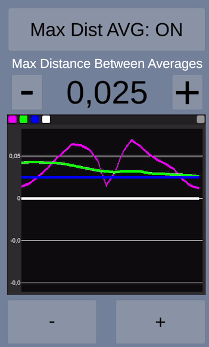
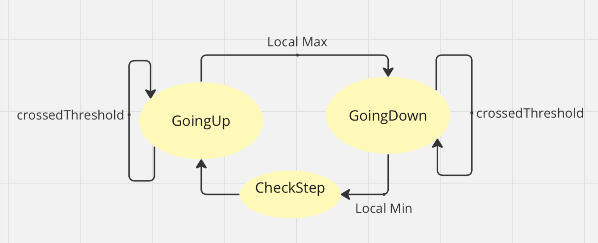
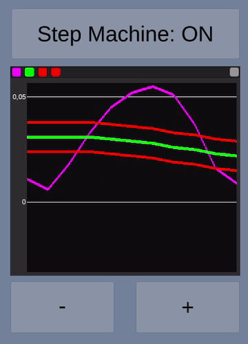
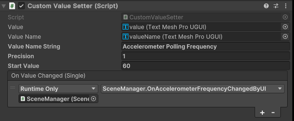
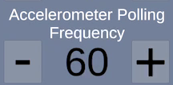
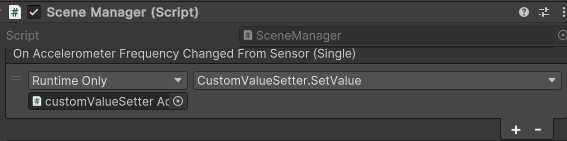

# Motion Tracker
###### *An accelerometer-based motion tracking library to detect when the user is standing still or moving*
### Features
* Uses accelerometer's magnitude to be independent of device orientation.
* Low-pass filter to smooth out the accelerometer's readings.
* Moving Average realtime calculation of the current movement.
* Data collection mode to train the algorithm about what "standing-still" means and initialise automatically some thresholds.
* 3 different approaches to motion detection
	* __threshold-based__: if movement is stronger than the maximum magnitude detected during data analysis.
	* __average-based__: if current moving average is higher than the average detected when standing still during data analysis.
	* __step detection state machine__: experimental approach to detect a step when the motion wave goes up and down, crossing the moving average two times.
* Every motion detection mode is independent and can be turned on/off.
* Every threshold and parameter can either be automatically acquired by following the training/data collection step or manually configured.
-------------
### Motion Detection 
#### Data Collection (Training)
When in training state (and not in motion detection state)  the accelerometer readings are collected and analysed, building the algorithm's knowledge about the following:
* __Still average__: the average magnitude of accelerometer when the device is supposed to stay as still as possible, on a flat surface or in hand.
* __High threshold__: the maximum magnitude value registered.
* __Max distance between averages__: a maximum increment of 75%(default value) above the _still average_.

After data collection is stopped, and data analysis is activated, these thresholds and values will be automatically acquired by the algorithm.

_Note: this mode is intended for the developers to quickly collect and analyse data samples. If used into a production application, the user might try to "cheat" by moving the device while training, resulting in skewed threshold readings.
It is much better to collect and analyse a lot of data samples and then come out with base-values that fit the most common patterns._


#### High Threshold
When the High Threshold check is enabled, the algorithm will detect motion as soon as the current accelerometer's magnitude reading is higher than the threshold.

</img>
>Accelerometer's magnitude (magenta) going over the High Threshold (white)

#### Distance Between Averages
When the Max Distance Between Averages check is enabled, the algorithm compares the current running average with the average detected during training (or hard-coded, alternatively).

If the current running average distances itself too much from the still average, motion is detected.

This check is more reliable than the High Threshold one, because it accounts for the running average of current movements, and if well-tuned it can detect soft steps as they inevitably raise the running average over the still average. 

_Note: by default the distance is calculated as a 75% max increment above the still average. This value can be changed in the code and is just an indication to help position the max distance, which should still be manually tuned to suit the application's specific needs._

</img>
>Accelerometer's magnitude (magenta) raises the current Moving Average (green) over the Max Distance between Averages (blue)
#### Step Detection State Machine
As an experimental approach, a step detection machine has been included.
Based on the current accelerometer's magnitude reading, the state can either be
* Going Up
* Going Down
* Check Step

The following image shows the state machine conceptual map

</img>
> Sequence of state is Up>Down>StepCheck>Up>etc...

During the Up and Down states, it is also checked if the wave crossed the current moving average.
During Check Step, if the wave went Up and Down by crossing the moving average two times, the machine counts this event.
Based on how many Up/Down events are considered to be a step (typally one or two), it is then possible to run custom logic upon step detection.

#### Wave Amplitude check
As an additional configuration of the step-recognition machine, it is possible to enable an amplitude threshold that the wave must overcome when crossing the moving average in either direction. This ensures that the crossing is not involuntary due to shaking or sensor noise, and a certain vertical distance between the peak/through and the moving average is achieved.

</img>
> The max and min amplitudes are represented as red lines at fixed distance from the moving average, that must be crossed while going Up and Down to register an Up/Down event valid for step count.
-------------
### UI separation 
Complementing the algorithm, this project shows off a fully functional UI developed ad-hoc to visualise and modify all the important thresholds and values at runtime, while providing an example usage of the algorithm.

Full detachment between code and UI has been achieved, the __sensorReader.cs__ script must be attached as a component to a GameObject in the scene and referenced by the __SceneManager__. 

It is possible to have full control of the sensors and their readings and subscribe custom callbacks to _OnStill_, _OnMoving_,_OnStateMachineStepDetected_ events and many others, to get notified of each and every threshold value change.
```
 sensorReader.OnStateMachineStepDetected += (localMin, localMax) => { OnStateMachineStepDetected(localMin, localMax); };
```
An ad-hoc _CustomValueSetter_ script and prefab have been developed to easily visualise and change threshold values, and also in this case a _subcription-based approach_ is followed to connect the UI to the code, via __Unity Events__ exposed in the Editor.

</img>  </img>
> The custom prefab connected to the customValueSetter script and how it appears in the editor, with the Unity Event conveniently exposed for fast connection to the code
```
[CustomValueSetter.cs]
    public UnityEvent<float> onValueChanged = new UnityEvent<float>();
    
    public void OnPlusClicked()
    {
        if (value.text != null) 
        {
            float newValue = float.Parse(value.text) + precision;
            value.text = newValue.ToString(precisionF);
            onValueChanged.Invoke(newValue);
        }
    }
```
> The customValueSetter calls the Unity Event set via editor, whenever the UI changes the controller value.
```
[SceneManager.cs]
sensorReader.OnAccelerometerFrequencyChanged += (newValue) => { OnAccelerometerFrequencyChangedFromSensor.Invoke(newValue); };
```
> In turn, the SceneManager subscribes to the sensorReader callback, to be notified whenever the algorithm decides to change its internal values (during setup, data analysis or at runtime)

 </img>
> The SceneManager additionally notifies back the UI of the change coming from the sensorReader, closing the circle and keeping the displayed value up to date
> 
As a result of this __two-way event system custom approach__, the UI can be used to control the threshold values and in turn it can also display the values updated by the sensor.
### Future evolutions

#### Runtime autonomous threshold adjustment
While out of scope for this project, it is absolutely possible to integrate a continuous analysis of the accelerometer values and manipulate the thresholds to account for patterns and special movements.
#### GPS sensor data
To detect users moving with transport means like cars and bicycles, or simply as an addition check while on foot, a gps sensor reader could be implemented to confirm if the user is moving or not.

_It is suggested to carefully use the gps sensor, as it is known to be battery-draining._

Additionally, a custom _Kalmann_ filter is usually paired with the sensor readings to filter any possible noise and error in positioning.

Once the data is available and trustworthy, a good starting point would be to check the position at the beginning of still detection and at the end of the delay required for the algorithm to declare stillness. 
If the position has not changed during this time, we can confirm with just two readings that the accelerometer was correct.

#### Step Machine
The step machine is an experimental approach to step detection, and definitely needs addition data collection and analysis to further implement pattern recognition.

Nonetheless, it provides a good starting point that can be easily upgraded to suit specific needs.

A first improvement would be to account for asymmetric patterns. In fact, it has been observed in case of soft steps, that the common occurrence would be 2 Up/Downs paired with at least the first Up overcoming the amplitude check, but not necessarily so for the others. 
This could lead to expanding the step check for different occurrences of Up/Downs, where not all of them have necessarily satisfied the amplitude check of the moving average crossing.

The machine could also be further expanded to allow for many different patterns, and eventually be directly used for pattern analysis and recognition by first detecting and storing patterns in terms of peaks/throughs, crossings, amplitude etc. and then looking for those pattern immediately after.

-------------
### SensorReader.cs - Documentation

| Properties name | Description                    |
| ------------- | ------------------------------ |
| `IsStepRecognitionMachineEnabled`      | Enable/disable the step recognition machine      |
| `IsWaveAmplitudeCheckActive`   | Enable/disable the additional check on the wave's amplitude to register an Up/Down event     |
| `MaxWaveAmplitude`   | The amplitude that must be overcome for the check to pass (movement recognised)    |
| `NumberOfPeaksForAStep`   | Define the number of Up/Downs to consider one step executed     |
| `IsMaxDistanceBetweenAveragesEnabled`   | Enable/disable the distance between averages check    |
| `MaxDistanceBetweenAverages`   | The distance that must be overcome by the moving average (from the still average) for the check to pass (movement recognised)    |
| `DefaultMaxDistanceFromStillAverage`   | The default percentage between the still average and the high threshold at which the _MaxDistanceBetweenAverages_ is positioned by default     |
| `IsHighThresholdEnabled`   | Enable/disable the high threshold check      |
| `HighThreshold`   | The value that the acceleration's magnitude must overcome for the check to pass (movement recognised)    |
| `AccelerometerFrequency`   | Polling frequency for the accelerometer. Higher values mean higher battery consumption, lower values mean less accuracy    |
| `MovingAverageWindowSize`   | The windows size for the moving average i.e. how many sensor readings (from now to t-size) to consider for calculating the average. Higher values mean slower adapting moving average. Lower values mean more reactive moving average  |
| `AccelerometerUpdateInterval`   | Numerator of the Low Pass filter factor. Represents the update interval of the accelerometer in seconds. Higher values mean less frequent updates. Lower values mean more frequent updates    |
| `LowPassKernelWidthInSeconds`   | Denominator of the Low Pass filter factor. Represents the amount of smooting applied to the data. Higher values mean more smoothing at the cost of higher delay. Lower values mean  (and vice versa). Lower values mean less smoothing and therefore values closer to the raw data   |

#### Callbacks for Sensor>UI syncronisation
| Callback name | 
| ------------- | 
| `OnStateMachineStepDetected`      |
| `OnDelayForStillChanged`   |
| `OnHighThresholdChanged`   | 
| `OnMaxDistanceBetweenAveragesChanged`   | 
| `OnMaxWaveAmplitudeChanged`   |
| `OnNumberOfPeaksForAStepChanged`   | 
| `OnAccelerometerFrequencyChanged`   | 
| `OnMovingAverageWindowSizeChanged`   | 
| `OnAccelerometerUpdateIntervalChanged`   | 
| `OnLowPassKernelWidthInSecondsChanged`   | 

#### Setup (mandatory)
```
	public void SetupAndStartSensors(float stillDelayS, Action OnStillCallback, Action OnMovingCallback, SensorsReaderOptions? sensorsReaderOptions)
```
#### Example Initialisation
```
        SensorsReaderOptions sensorsReaderOptions = new SensorsReaderOptions
        {
            IsStepRecognitionMachineEnabled = false,
            MaxWaveAmplitude = 0.007f,
            IsWaveAmplitudeCheckActive = false,
            NumberOfPeaksForAStep = 1,

            IsMaxDistanceBetweenAveragesEnabled = true,
            MaxDistanceBetweenAverages = 0.015f,

            IsHighThresholdEnabled = true,
            HighThreshold = 0.05f,

            AccelerometerFrequency = 60,
            MovingAverageWindowSize = 20,
            AccelerometerUpdateInterval = 0.10f,
            LowPassKernelWidthInSeconds = 0.80f
        };
        sensorReader.OnStateMachineStepDetected += (localMin, localMax) => { OnStateMachineStepDetected(localMin, localMax); };
        sensorReader.OnDelayForStillChanged += (newValue) => { OnDelayForStillChangedFromSensor.Invoke(newValue); };
        sensorReader.OnHighThresholdChanged += (newThreshold) => { OnHighThresholdChangedFromSensor.Invoke(newThreshold); };
        sensorReader.OnMaxDistanceBetweenAveragesChanged += (newThreshold) => { OnMaxDistanceBetweenAveragesChangedFromSensor.Invoke(newThreshold); };
        sensorReader.OnMaxWaveAmplitudeChanged += (newValue) => { OnMaxWaveAmplitudeChangedFromSensor.Invoke(newValue); };
        sensorReader.OnNumberOfPeaksForAStepChanged += (newValue) => { OnNumberOfPeaksForAStepChangedFromSensor.Invoke(newValue); };
        sensorReader.OnAccelerometerFrequencyChanged += (newValue) => { OnAccelerometerFrequencyChangedFromSensor.Invoke(newValue); };
        sensorReader.OnMovingAverageWindowSizeChanged += (newValue) => { OnMovingAverageWindowSizeChangedFromSensor.Invoke(newValue); };
        sensorReader.OnAccelerometerUpdateIntervalChanged += (newValue) => { OnAccelerometerUpdateIntervalChangedFromSensor.Invoke(newValue); };
        sensorReader.OnLowPassKernelWidthInSecondsChanged += (newValue) => { OnLowPassKernelWidthInSecondsChangedFromSensor.Invoke(newValue); };

        sensorReader.SetupAndStartSensors(0.1f, OnStillCallback, OnMovingCallback, sensorsReaderOptions);
```
